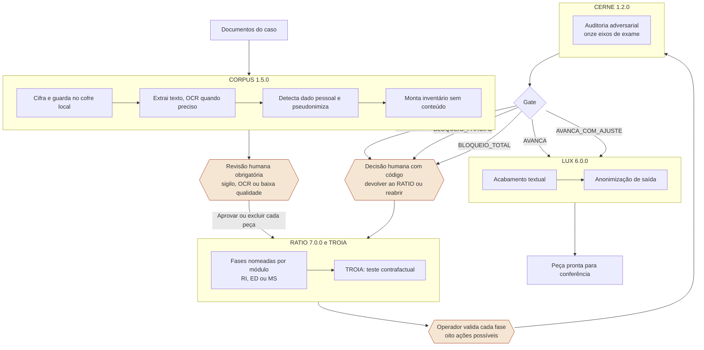

# ATRIO

O ATRIO é um sistema local de produção de peça jurídica que executa quatro
etapas em ordem fixa e registra cada passagem de uma etapa para a seguinte.
Documentos entram, são cifrados e inventariados; um protocolo decisório
conduz o raciocínio por fases nomeadas; uma auditoria adversarial confronta o
resultado antes de qualquer acabamento; e um módulo final ajusta o texto e
aplica a política de anonimização. Nada avança sem que um operador
identificado registre a decisão de avançar. Tudo roda em máquina local, sem
nuvem e sem serviço externo.

---

## O fluxo

As três caixas destacadas são pontos onde o sistema para e espera uma pessoa.
Elas não são exceção nem tratamento de erro. São o desenho.

---

## Composição de versões

A versão de cada componente é fixada na criação do caso e viaja em toda
resposta. Quem consome não escolhe versão e não mistura versões.

| Componente | Versão | Função |
|---|---|---|
| CORPUS | 1.5.0 | Ingestão, cofre, pseudonimização reversível, inventário, OCR |
| RATIO | 7.0.0 | Protocolo decisório governado, módulos RI, ED e MS |
| TROIA | 1.0.0 | Protocolo contrafactual interno do RATIO |
| CERNE | 1.2.0 | Auditoria adversarial do raciocínio, onze eixos, cinco gates |
| LUX | 6.0.0 | Acabamento textual e anonimização de saída |
| `atrio_pii` | 1.0.0 | Detecção de dado pessoal, compartilhada entre CORPUS e LUX |
| API | 0.7.0 | Plano de controle da execução |
| Adapter de inferência | 0.2.0 | Inferência local versionada e determinística |
| Infraestrutura | 1.0.0 | Banco, API e modelo em containers locais |
| Schema do banco | 1.3.0 | Persistência transacional e trilha operacional |

Identificador da release: `atrio-local-0.7.0-f9f81d9d-7ca7a772`. Os dois
sufixos são recortes dos digests do manifesto de build e do pacote normativo.
Se qualquer arquivo normativo mudar, o identificador muda.

Release técnica pública da API: `0.7.0`.

---

## Evidências disponíveis

**Validado operacionalmente.** Antes da implementação backend, o método ATRIO
foi aplicado e refinado em fluxo jurídico real por meio de plataformas online
de IA generativa, sob supervisão humana direta. A operação incluiu análise
individual de resultados, definição de padrões, incorporação de críticas e
extração de indicadores. Essas métricas descrevem o contexto observado e não
são tratadas como estimativas causais da API atual.

**Verificado em engenharia.** A suíte automatizada registra 175 testes
aprovados, com 0 falhas, 0 erros e 0 pulados. A evidência inclui JUnit,
ambiente, dependências e hashes dos artefatos.

**Avaliação experimental formal da API.** O protocolo está em fechamento, e
seus resultados serão registrados separadamente quando incorporados. Essa
etapa amplia a evidência da implementação atual sem substituir o histórico
operacional do método. O escopo está detalhado em
[AVALIACAO.md](AVALIACAO.md).

---

## Onde está cada coisa

| Documento | Para quê |
|---|---|
| [ARQUITETURA.md](ARQUITETURA.md) | Os módulos em linguagem de operação jurídica |
| [AVALIACAO.md](AVALIACAO.md) | Protocolo e estado da avaliação formal |
| [DEMONSTRACAO.md](DEMONSTRACAO.md) | Roteiro de dez minutos em tela compartilhada |
| [UMA-PAGINA.md](UMA-PAGINA.md) | Resumo para envio por e-mail |
| `../api/` | Kit técnico: rotas, configuração, operação |

Código: `packages/services/atrio_api`.
Infraestrutura: `infra`.
